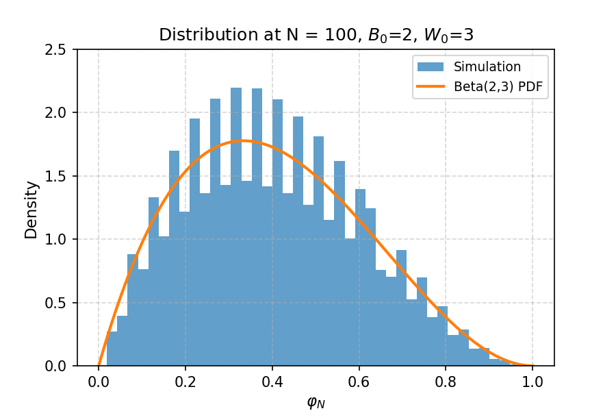

# Martingale Convergence: Pólya Urn Model

This project was for my Math 565A Stochastic Processes I class. I created a simulation of the convergence of the Polya urn model to the Beta distribution. 

## Pólya Urn Model

The Pólya urn is a reinforcement‐based stochastic process: you start with \(B_0\) black and \(W_0\) white balls in an urn. At each step you draw one ball at random, then return it along with an extra ball of the same color. This “rich-get-richer” rule makes the proportion
\[
\varphi_n = \frac{B_n}{B_n + W_n}
\]
a bounded martingale that converges almost surely, as \(n\to\infty\), to a random limit distributed \(\varphi_{\infty} \sim \mathrm{Beta}(B_0, W_0)\).  

  

